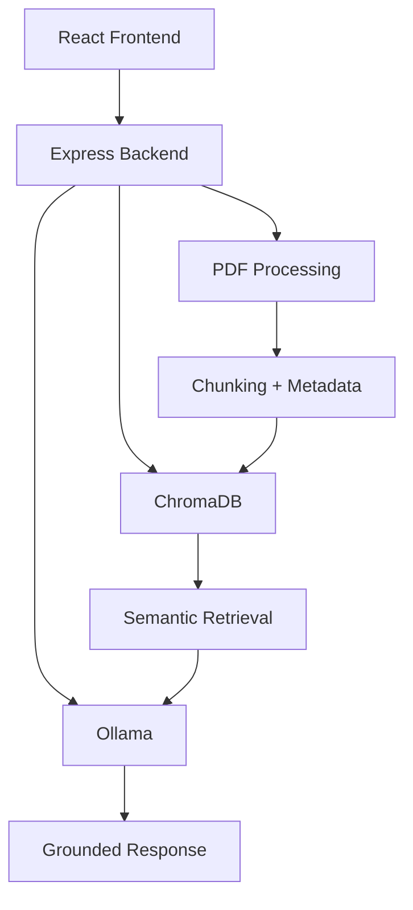

      

# DocQuery — AI-Powered Semantic Document Retrieval System

DocQuery is a fully local Retrieval-Augmented Generation (RAG) system that allows users to upload PDF documents and query them using semantic search and local LLM inference.

The system uses vector embeddings, metadata-aware retrieval, persistent vector storage, and local language models to provide context-grounded answers from uploaded documents.

### PS RUNS OFFLINE

---

# Features

- PDF document upload and processing
- Text chunking pipeline
- Semantic embeddings using Ollama
- Persistent vector storage using ChromaDB
- Metadata-aware retrieval
- Source-grounded answer generation
- Fully local AI inference
- Offline-capable architecture
- Dockerized backend infrastructure
- Full-stack container orchestration using Docker Compose

---
# Why This Project?

Most document chat systems rely on cloud APIs and external inference providers.

DocQuery was designed as a fully local and offline-capable Retrieval-Augmented Generation (RAG) system using local embeddings, local LLM inference, and persistent vector storage.

The project focuses on semantic retrieval infrastructure, metadata-aware querying, and containerized AI backend architecture.


# Tech Stack

## Frontend
- React
- Vite

## Backend
- Node.js
- Express.js

## AI / Retrieval
- Ollama
- Phi-3 Mini
- nomic-embed-text
- ChromaDB

## Infrastructure
- Docker
- Docker Compose


## Core Concepts & Algorithms

- Cosine similarity-based semantic retrieval
- Vector embedding search
- Retrieval-Augmented Generation (RAG)
- Sliding-window chunking with overlap
- Metadata-aware filtered retrieval
- Persistent vector indexing using ChromaDB
- Local LLM inference pipeline

---

# System Architecture



# Project Structure
```text
DOCQUERY/
│
├── Backend/
│   │
│   ├── src/
│   │   │
│   │   ├── controllers/
│   │   │   ├── uploadController.js
│   │   │   └── askController.js
│   │   │
│   │   ├── routes/
│   │   │   ├── uploadRoutes.js
│   │   │   └── askRoutes.js
│   │   │
│   │   ├── services/
│   │   │   ├── pdfService.js
│   │   │   ├── chunkService.js
│   │   │   ├── embeddingService.js
│   │   │   ├── chromaService.js
│   │   │   ├── retrievalService.js
│   │   │   ├── similarityService.js
│   │   │   └── llmService.js
│   │   │
│   │   ├── store/
│   │   │   └── chunkStore.js
│   │   │
│   │   └── uploads/
│   │
│   ├── Dockerfile
│   ├── compose.yaml
│   ├── package.json
│   ├── .dockerignore
│   ├── .gitignore
│   └── server.js
│
├── Frontend/
│   │
│   └── docuquery-frontend/
│       │
│       ├── src/
│       │   ├── components/
│       │   ├── pages/
│       │   ├── services/
│       │   └── App.jsx
│       │
│       ├── public/
│       ├── Dockerfile
│       ├── package.json
│       ├── vite.config.js
│       └── .dockerignore
│
└── README.md
```
# Setup & Start Guide

This project supports two setup methods:

1. Docker Compose Setup (Recommended)
2. Manual Local Setup

---

# Option 1 — Docker Compose Setup (Recommended)

## Prerequisites

Make sure the following are installed:

- Docker Desktop
- Ollama
- Node.js 23+ (optional for local development)

---

# Step 1 — Clone Repository

```bash
git clone <your-repository-url>
cd DOCQUERY
```

---

# Step 2 — Install Ollama

Download and install Ollama:

https://ollama.com

---

# Step 3 — Pull Required Models

```bash
ollama pull phi3:mini
ollama pull nomic-embed-text
```

---

# Step 4 — Start Ollama

```bash
ollama serve
```

Keep Ollama running in the background.

---

# Step 5 — Start Full Containerized Stack

Open a new terminal.

Navigate to Backend directory:

```bash
cd Backend
```

Run Docker Compose:

```bash
docker compose up --build
```

---

# Running Services

| Service | URL |
|---------|-----|
| Frontend | http://localhost:5173 |
| Backend API | http://localhost:5001 |
| ChromaDB | http://localhost:8000 |

---

# Stop Containers

Inside Backend directory:

```bash
docker compose down
```

---

# Option 2 — Manual Local Setup

## Prerequisites

Install:

- Node.js 23+
- Ollama
- ChromaDB
- npm

---

# Step 1 — Clone Repository

```bash
git clone <your-repository-url>
cd DOCQUERY
```

---

# Step 2 — Backend Setup

Navigate to backend:

```bash
cd Backend
```

Install dependencies:

```bash
npm install
```

---

# Step 3 — Frontend Setup

Open a new terminal.

Navigate to frontend:

```bash
cd Frontend/docuquery-frontend
```

Install dependencies:

```bash
npm install
```

---

# Step 4 — Install Ollama

Download and install:

https://ollama.com

---

# Step 5 — Pull Required Models

```bash
ollama pull phi3:mini
ollama pull nomic-embed-text
```

---

# Step 6 — Start Ollama

```bash
ollama serve
```

---

# Step 7 — Start ChromaDB

Using Docker:

```bash
docker run -p 8000:8000 chromadb/chroma
```

---

# Step 8 — Start Backend Server

Inside Backend directory:

```bash
node server.js
```

---

# Step 9 — Start Frontend

Inside frontend directory:

```bash
npm run dev
```

---

# Manual Setup Service URLs

| Service | URL |
|---------|-----|
| Frontend | http://localhost:5173 |
| Backend API | http://localhost:5001 |
| ChromaDB | http://localhost:8000 |

---

# Example Workflow

1. Upload a PDF document
2. Extract and chunk text
3. Generate embeddings
4. Store vectors in ChromaDB
5. Ask semantic questions
6. Retrieve relevant chunks
7. Generate grounded AI responses

---

# Offline Capability

After initial setup and model downloads, the system works fully offline using:

- Local LLM inference
- Local embeddings
- Persistent vector storage
- Dockerized infrastructure


#AUTHOR
built by ##Dhruv Dogra
