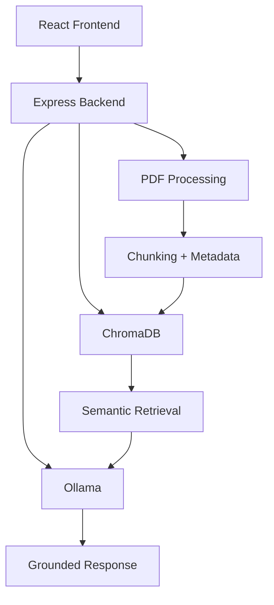

# DocQuery — AI-Powered Semantic Document Retrieval System

DocQuery is a fully local Retrieval-Augmented Generation (RAG) system that allows users to upload PDF documents and query them using semantic search and local LLM inference.

The system uses vector embeddings, metadata-aware retrieval, persistent vector storage, and local language models to provide context-grounded answers from uploaded documents.

---

# Features

- PDF document upload and processing
- Text chunking pipeline
- Semantic embeddings using Ollama
- Persistent vector storage using ChromaDB
- Metadata-aware retrieval
- Source-grounded answer generation
- Fully local AI inference
- Offline-capable architecture
- Dockerized backend infrastructure
- Full-stack container orchestration using Docker Compose

---

# Tech Stack

## Frontend
- React
- Vite

## Backend
- Node.js
- Express.js

## AI / Retrieval
- Ollama
- Phi-3 Mini
- nomic-embed-text
- ChromaDB

## Infrastructure
- Docker
- Docker Compose

---

# System Architecture



# Project Structure
```text
DOCQUERY/
│
├── Backend/
│   │
│   ├── src/
│   │   │
│   │   ├── controllers/
│   │   │   ├── uploadController.js
│   │   │   └── askController.js
│   │   │
│   │   ├── routes/
│   │   │   ├── uploadRoutes.js
│   │   │   └── askRoutes.js
│   │   │
│   │   ├── services/
│   │   │   ├── pdfService.js
│   │   │   ├── chunkService.js
│   │   │   ├── embeddingService.js
│   │   │   ├── chromaService.js
│   │   │   ├── retrievalService.js
│   │   │   ├── similarityService.js
│   │   │   └── llmService.js
│   │   │
│   │   ├── store/
│   │   │   └── chunkStore.js
│   │   │
│   │   └── uploads/
│   │
│   ├── Dockerfile
│   ├── compose.yaml
│   ├── package.json
│   ├── .dockerignore
│   ├── .gitignore
│   └── server.js
│
├── Frontend/
│   │
│   └── docuquery-frontend/
│       │
│       ├── src/
│       │   ├── components/
│       │   ├── pages/
│       │   ├── services/
│       │   └── App.jsx
│       │
│       ├── public/
│       ├── Dockerfile
│       ├── package.json
│       ├── vite.config.js
│       └── .dockerignore
│
└── README.md
```
